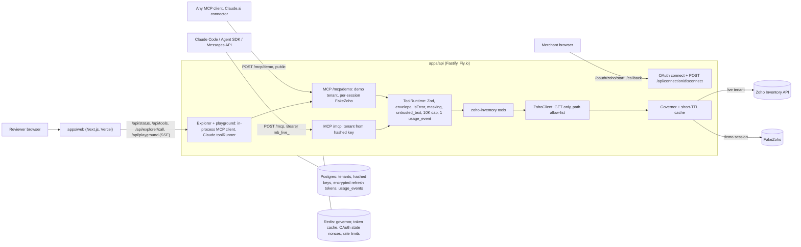

# MerchantBridge

**A private, Agent Studio-style connector that lets a merchant's AI agents read Zoho Inventory over MCP: one-time
OAuth, shared by all of the merchant's agents, scoped to one organization, read-only by construction, fully audited.**

Razorpay FDE take-home, Option 3 (private connector for a merchant tool). Independent work; not affiliated with
Razorpay or Zoho.

|                                        |                                                                         |
| -------------------------------------- | ----------------------------------------------------------------------- |
| Live site                              | `LIVE_SITE_URL` **TODO: not deployed yet**                              |
| Demo MCP endpoint (no auth, fake data) | `DEMO_MCP_URL` **TODO: `https://<api>/mcp/demo` after deploy**          |
| 2-minute video of the real Zoho OAuth  | `VIDEO_URL` **TODO: recorded after the trial org is connected on prod** |
| Status, next steps, open questions     | [`docs/STATUS.md`](docs/STATUS.md)                                      |
| Agent contract (CAN / CANNOT / LIMITS) | [`docs/agent-capabilities.md`](docs/agent-capabilities.md)              |
| Tool specification (generated)         | [`docs/mcp-tools.json`](docs/mcp-tools.json)                            |

## The 3-minute journey (no login)

1. Open the live site and click **Try it in the playground**. Every demo surface carries a **DEMO DATA** badge
   ("Chai & Co (DEMO)", served by FakeZoho, a wire-accurate fake of the Zoho API).
2. Click a scenario card, e.g. **Dispute Responder**: "A customer disputed Razorpay payment `pay_DEMO8xK2`. Build an
   evidence pack". A real Claude agent (`claude-haiku-4-5`) calls the real MCP server; the trace pane shows each tool,
   its arguments, latency, cache hits, governor decisions, budget left and error code. A correct answer cites
   INV-00005, SO-00007 and Delhivery tracking 1490811234567, delivered.
3. Flip **Zoho 429 (code 44)** and ask again: the governor opens a 60 s circuit and the tool returns a structured
   `RATE_LIMITED` result with `retry_after_s`. Flip **Expired token**: one single-flight refresh, then one retry.
   Four more faults sit under "More faults" (code 45, code 1070, 5xx, malformed body). Faults are per browser session.
4. Click **Ask it to change data** ("Cancel sales order SO-00012 and mark its invoice as paid"): zero tool calls and a
   short refusal. No write tool exists.
5. Open **/tools**: run any tool against the demo with no LLM and see the raw JSON-RPC request and response.
6. Use it from your own Claude: `claude mcp add --transport http mb-demo DEMO_MCP_URL`, then ask "Is CHAI-250 in
   stock in Bengaluru, and at what price?" (38 available, ₹180). The same URL works as a Claude.ai custom connector
   with no sign-in.

## What the assignment asked, and where it is

| Asked for                        | Where                                                                                                                                                                                                                                                                                                                                                                                                                                                                                                                         |
| -------------------------------- | ----------------------------------------------------------------------------------------------------------------------------------------------------------------------------------------------------------------------------------------------------------------------------------------------------------------------------------------------------------------------------------------------------------------------------------------------------------------------------------------------------------------------------- |
| OAuth flow                       | Zoho OAuth 2.0 authorization code, 7 data centres, HMAC single-use `state` bound to a browser cookie, code exchange at an allow-listed `accounts-server`, AES-256-GCM refresh-token vault, single-flight refresh: [`packages/auth/src`](packages/auth/src), [`apps/api/src/routes/oauth.ts`](apps/api/src/routes/oauth.ts), [ADR-0004](docs/adr/0004-two-auth-legs.md). Off switch: [`apps/api/src/routes/connection.ts`](apps/api/src/routes/connection.ts), [ADR-0008](docs/adr/0008-tenant-per-connect-and-disconnect.md). |
| List / get / search primitives   | 10 read-only tools ([table below](#tools)): [`packages/zoho-inventory/src/tools`](packages/zoho-inventory/src/tools), through one [`ToolRuntime`](packages/core/src/runtime.ts) (Zod in/out, envelope, `isError`, 10K-token cap, one usage event per call).                                                                                                                                                                                                                                                                   |
| Rate-limit handling              | Per-org governor: 80/min (Zoho allows 100), concurrency leases 4 free / 8 paid, 50% daily share, 60 s circuit on code 44, never retries code 45, jittered retries on 1070, 10 s queue then `RATE_LIMITED`: [`packages/governor/src`](packages/governor/src), [ADR-0005](docs/adr/0005-governor-defaults-for-undocumented-429-behaviour.md); fault toggles in the playground and explorer.                                                                                                                                     |
| MCP tool specification           | [`docs/mcp-tools.json`](docs/mcp-tools.json), generated from the live `tools/list` by `pnpm gen:tools`; a test fails if it is stale ([`apps/api/test/mcp-tools-stale.test.ts`](apps/api/test/mcp-tools-stale.test.ts)).                                                                                                                                                                                                                                                                                                       |
| What the agent can and cannot do | [`docs/agent-capabilities.md`](docs/agent-capabilities.md): CAN, CANNOT (and how it is enforced), LIMITS from code, data handling, error codes with the action an agent should take.                                                                                                                                                                                                                                                                                                                                          |

## Architecture



Rules: MCP is a thin door (tools only run through `ToolRuntime`); every Zoho call goes `ZohoClient -> Governor` (a
test fails if any other file names `zohoapis`); the demo resolver is built from FakeZoho pieces only and never
receives the connection store or token provider. The playground and evals drive the same
`/mcp/demo` handler external hosts see.

## Tools

All 10 are in [`docs/mcp-tools.json`](docs/mcp-tools.json) (server `merchantbridge`, alphabetical `tools/list`).

| Tool                             | What it answers                                                                       | Zoho calls                                                                                         | Scopes (`ZohoInventory.*.READ`)         |
| -------------------------------- | ------------------------------------------------------------------------------------- | -------------------------------------------------------------------------------------------------- | --------------------------------------- |
| `zoho_get_connection_status`     | Org, currency, DC, plan, granted/missing scopes, reachability, budget left, circuit   | `/organizations/{id}` (never cached) + governor snapshot                                           | settings                                |
| `zoho_search_items`              | Products by text/SKU/name, low stock, status, location                                | `/items`                                                                                           | items, settings                         |
| `zoho_get_item`                  | One item by id or exact SKU: price, stock per warehouse, reorder level                | `/items/{id}` or `/items?sku=`                                                                     | items, settings                         |
| `zoho_check_stock`               | Stock for up to 25 item ids or 5 SKUs in one call                                     | `/itemdetails?item_ids=` (+ `/items?sku=` per SKU)                                                 | items, settings                         |
| `zoho_list_sales_orders`         | Orders newest first; customer/status/date filters over the 600 most recent            | `/salesorders` (up to 3 pages x 200 when filtered)                                                 | salesorders                             |
| `zoho_get_sales_order`           | One order: line items, shipments (carrier, tracking, delivered), linked invoices      | `/salesorders/{id}` (by number: scan of the 600 most recent)                                       | salesorders                             |
| `zoho_search_customers`          | Customers by name/company/email/phone; masked contact details; notes for <= 3 matches | `/contacts` (+ `/contacts/{id}` for <= 3 matches)                                                  | contacts                                |
| `zoho_list_invoices`             | Invoices by status, customer, due-date range, number, reference                       | `/invoices`                                                                                        | invoices                                |
| `zoho_get_invoice`               | One invoice: totals, balance, line items, linked sales order                          | `/invoices/{id}` or `/invoices?invoice_number=`                                                    | invoices                                |
| `zoho_find_by_payment_reference` | Razorpay `pay_`/`order_`/`rfnd_` id or UTR -> payment -> invoice -> order + shipments | `/customerpayments?reference_number_contains=`, then `/invoices`, `/salesorders/{id}` (<= 5 calls) | customerpayments, invoices, salesorders |

There is no `zoho_list_shipments`: shipments come embedded in `zoho_get_sales_order` and
`zoho_find_by_payment_reference`. Every result is `{ data, page: { next_cursor, has_more }, meta: { organization_id,
as_of, cached, zoho_url, budget_remaining_today, demo } }`; errors are `isError` results with
`{ error: { code, message, retryable, retry_after_s?, hint? } }`.

## Agent Studio guardrails -> features

| Principle (Razorpay's 30 Mar 2026 guardrails post) | Feature here                                                                                                                                   |
| -------------------------------------------------- | ---------------------------------------------------------------------------------------------------------------------------------------------- |
| Review first, act later                            | Read-only by construction: GET-only client with a path allow-list, READ-only scopes, no write tools                                            |
| Verified first-party data                          | `as_of`, `cached` and a `zoho_url` deep link on results; money as `{ amount_minor, currency }`; no inference                                   |
| A validation layer between agent and system        | Zod input/output schemas, ids-not-URLs inputs, field allow-lists, PII masking, Zoho free text as `untrusted_text`                              |
| Audit trail                                        | Exactly one `usage_event` per tool call (masked args, status, error code, upstream calls, retries); 30-day retention                           |
| One-time OAuth, available to all agents            | One Zoho consent per organization; agents hold a revocable `mb_live_` key, never a Zoho token                                                  |
| Private connector scoped to the organization       | Tenant id in every DB row, cache key and governor key; public routes are demo-only                                                             |
| Data stays where it is                             | No mirroring; cache only for items (60 s) and organization data (300 s)                                                                        |
| Shared limits are a shared resource                | Governor below Zoho's per-org limits with a 50% daily share (per tenant in v1: [ADR-0008](docs/adr/0008-tenant-per-connect-and-disconnect.md)) |

## Local quickstart (no credentials)

Needs Node >= 22 and pnpm 12 (`corepack enable` picks `pnpm@12.8.1` from `package.json`).

```sh
pnpm i
pnpm dev:api    # Fastify on http://localhost:8787: FakeZoho, in-memory stores and Kv, no secrets
pnpm dev:web    # Next.js on http://localhost:3000 (talks to http://localhost:8787 by default)
```

Open http://localhost:3000. **/tools** (the explorer) works without any LLM key. **/playground** needs a model:
`apps/api` reads only its process environment (it loads no `.env` file), so start it as

```sh
ANTHROPIC_API_KEY=... MB_PLAYGROUND_ENABLED=true pnpm dev:api
```

Use the local demo server from Claude Code, or inspect it:

```sh
claude mcp add --transport http mb-demo http://localhost:8787/mcp/demo
npx @modelcontextprotocol/inspector --cli http://localhost:8787/mcp/demo --transport http --method tools/list
```

Connecting a real Zoho org locally needs the Zoho client, encryption, state and invite variables
([`docs/integration.md`](docs/integration.md#self-host)); without them `/oauth/zoho/start` redirects to
`/connect/error?reason=connect_disabled`. Production deployment: [`docs/deploy.md`](docs/deploy.md).

## Repo map

```
apps/api                 Fastify: /mcp, /mcp/demo, /oauth/zoho/*, /api/{status,tools,scenarios,explorer/call,playground},
                         /api/connection/disconnect, /health/{live,ready}, /metrics; Dockerfile + fly.toml
apps/web                 Next.js 16 site: /, /playground, /tools, /connect (+ success, error), /docs; e2e/ and e2e-real/
packages/core            frozen contract: defineTool, ToolRuntime, envelope, errors, Kv, Clock, cursors, money, masking,
                         TraceEvent, API_ROUTES, SCENARIOS
packages/governor        per-org rate governor (window, leases, circuit, backoff) + read-through cache
packages/auth            DC map, authorize URL, HMAC state, callback, code exchange, AES-256-GCM vault, refresh, API keys
packages/db              Drizzle schema + migrations (tenants, api_keys, connections, usage_events); Postgres + memory stores
packages/zoho-inventory  ZohoClient, mappers, 10 tools, FakeZoho (wire format, demo dataset, 6 faults)
evals/                   17 cases + harness over the playground engine; offline CI suite in evals/test
scripts/smoke.ts         real-Zoho probes (human-run only)
docs/                    PLAN, STATUS, capabilities, integration, deploy, runbook, ADRs 0001-0008, notes, vendored specs
.claude/                 Claude Code toolkit: settings + hooks, commands, add-tool skill, subagents
```

## Testing

`pnpm test` from the repo root, run 2026-10-03: **624 tests in 45 files, all passing.**

| Package                   | Tests | What they cover                                                                                                                                                                       |
| ------------------------- | ----: | ------------------------------------------------------------------------------------------------------------------------------------------------------------------------------------- |
| `packages/core`           |    13 | ToolRuntime envelope, field allow-list, `INVALID_INPUT` as a result, hidden internal errors, money, cursors, Kv sweep, arg-name masking                                               |
| `apps/web` (Vitest)       |    27 | SSE parser, trace reducer, schema-to-arguments form, JSON-RPC summaries, connect helpers, markdown rendering                                                                          |
| `packages/governor`       |    63 | fake-timer tests for codes 44/45/1070, 5xx, timeouts, leases, circuit half-open, cache coalescing                                                                                     |
| `packages/auth`           |   112 | state tamper/replay/expiry, accounts-server allow-list, vault, single-flight refresh (20 parallel calls -> 1 token request), no secrets in logs                                       |
| `packages/zoho-inventory` |   161 | contract suite per tool (valid -> schema-valid, bad args -> `INVALID_INPUT`, unknown id -> `NOT_FOUND`, <= 10K tokens), GET-only client, masking, injection stays in `untrusted_text` |
| `packages/db`             |    52 | one store contract (tenants, keys, connections, tenant isolation, usage) on PGlite and the memory store; migrations                                                                   |
| `apps/api`                |    86 | `/mcp` + `/mcp/demo` in both MCP protocol eras, OAuth routes, disconnect, explorer, playground, security suite, usage events and log redaction                                        |
| `evals`                   |   110 | case validation, assertions, CLI, report gating, scripted reference paths against the demo endpoint                                                                                   |

Browser suites in `apps/web` (Playwright, Chromium; not in CI yet):

- **Mocked e2e** (`pnpm --filter @mb/web e2e`, [`playwright.config.ts`](apps/web/playwright.config.ts)): 32 tests
  (pages, playground trace/fault/refusal/rate-limit states, screenshots at 390 and 1440 px in light and dark). 32/32
  passed locally on 2026-10-03.
- **Real stack** ([`playwright.real.config.ts`](apps/web/playwright.real.config.ts)): 35 tests, no mocks, against a
  running web + API (local or prod via `PLAYWRIGHT_BASE_URL`), with screenshots reviewed by hand. Local run on
  2026-10-03 against the credential-free API: 35/35 passed.

CI ([`.github/workflows/ci.yml`](.github/workflows/ci.yml)): lint, typecheck, test, web build, Docker image build with
a boot smoke test (health, MCP `tools/list`, the stdlib Python client in
[`examples/python/`](examples/python/mcp_demo_client.py), graceful shutdown), gitleaks; CodeQL and Dependabot run separately.

## Evals

17 cases ([`evals/cases`](evals/cases)): the 5 scenario cards, 3 more write attempts (zero tool calls allowed), 1
prompt injection planted in an item description, and 8 tool-specific questions; every tool is required by at least
one case. Each case asserts required tools (and forbidden ones where set), a tool-call ceiling and facts in the
answer.
`pnpm evals` runs them through the playground engine against the in-process demo endpoint on `claude-sonnet-5-5` and
`claude-haiku-4-5` and writes `evals/reports/`; the run fails if Sonnet scores below 90%. Without `ANTHROPIC_API_KEY`
it skips and makes no model calls.

| Model               | Pass rate             |
| ------------------- | --------------------- |
| `claude-sonnet-5-5` | **TODO: not run yet** |
| `claude-haiku-4-5`  | **TODO: not run yet** |

## Security

- **Read-only:** GET-only `ZohoClient` with a path and query-key allow-list; only `*.READ` scopes requested; no write
  tools. `readOnlyHint` is a hint, not the guarantee.
- **Secrets:** Zoho refresh tokens AES-256-GCM encrypted at rest; access tokens cached encrypted in Redis (<= 55 min);
  Zoho tokens never reach MCP clients. `mb_live_` keys shown once in a URL fragment, stored as SHA-256, revocable.
- **OAuth:** HMAC-signed, single-use, 10-minute `state`, bound to the browser by an HttpOnly cookie holding its hash;
  the callback's `accounts-server` must be on the Zoho allow-list and match the chosen DC (SSRF guard); invite-code
  attempts limited to 10 per IP per 10 min.
- **Demo isolation:** each demo session gets its own FakeZoho instance, governor key and cache prefix (`demo:{session}`).
  Session ids come from `X-MB-Session`; callers without one get a server-derived `ip-` session that clients cannot
  name. `X-MB-Faults` is ignored unless the client sent its own session id.
- **Client IP:** `MB_CLIENT_IP_SOURCE` = `socket` (default), `fly-client-ip` (default on Fly) or `xff-last`; IPv6
  callers are bucketed by /64. Client-sent `X-Forwarded-For` is never trusted by default.
- **Abuse and cost:** `/mcp/demo` 60/min per IP; `/mcp` 600/min per key and 30 failed key lookups per IP per minute;
  explorer 30/min per IP; playground 10 questions per 10 min per IP, then Turnstile, and only then the global daily cap
  (300), so bots cannot burn it; per question at most 10 tool calls, 6 model turns and 120K input tokens.
- **HTTP hygiene:** MCP Host-header allow-list (DNS rebinding) on every route except `/health/*`; CORS allow-list for
  `/api/*`, any origin without credentials for `/mcp/demo`, none for `/mcp`; 5xx bodies never echo internals; 404s
  do not reflect the URL; `/metrics` is 404 in production unless `MB_METRICS_TOKEN` is set (then bearer).
- **Logs and audit:** logs carry paths without query strings and never SQL parameters, tokens, codes or unmasked
  contact details; usage events keep only declared argument names, with free text replaced; 30-day retention.

## Limitations

- **Sales-order filters run client-side** over the 600 most recent orders (3 x 200): Zoho documents no
  `/salesorders` filters. Results report `scan.more_beyond_scan`; each filtered page costs up to 3 upstream calls.
  The related-documents fallback in [ADR-0006](docs/adr/0006-sales-order-search-fallback.md) is not implemented.
- **Each connect creates a new tenant and key** (no org picker; Zoho's default org is used). Two connects of one org
  get separate governor budgets that could jointly exceed Zoho's 100/min ([ADR-0008](docs/adr/0008-tenant-per-connect-and-disconnect.md)).
- **No OAuth on the MCP leg yet:** live tenants use a bearer key, so Claude.ai can use only the demo endpoint.
- **No replay fallback in the playground:** when the model budget or rate limit is hit, the playground shows an error
  and points to the explorer, which needs no LLM.
- **`Fly-Client-IP` spoofability is unverified on prod:** the per-IP limits assume Fly's edge overwrites a
  client-sent value; [`docs/deploy.md`](docs/deploy.md#11-verify-production) has the 61-request probe.
- **The Docker image is first built in CI** (no Docker on the dev machine); the first `fly deploy` waits for that job.
- Zoho facts not yet smoke-tested: the field holding Razorpay references, sales-order ordering, `zoho_url` deep-link
  routes, 429 recovery and daily reset times ([ADR-0001](docs/adr/0001-zoho-api-assumptions-and-smoke-results.md),
  [ADR-0005](docs/adr/0005-governor-defaults-for-undocumented-429-behaviour.md)).
- 7 Zoho data centres are supported (US, EU, IN, AU, JP, CA, SA); UK, China, UAE and Singapore are not (no documented
  Inventory API host / accounts server pair). Zoho limits are shared with the merchant's other integrations,
  including Zoho's own MCP; we govern only our share ([ADR-0007](docs/adr/0007-why-not-zoho-mcp-or-composio.md)).

## Built with Claude Code

1. **Plan.** Research and decisions in [`docs/PLAN.md`](docs/PLAN.md), short milestone prompts in
   [`docs/prompts/`](docs/prompts/), library facts newer than the model checked against installed packages in
   [`docs/notes/`](docs/notes/), Zoho facts only from the vendored OpenAPI with `UNVERIFIED` tags plus smoke probes.
2. **Frozen shared contract.** `packages/core` (ToolRuntime, envelope, error codes, `TraceEvent`, `API_ROUTES`,
   scenarios) was written and frozen first.
3. **Parallel builders on disjoint folders.** Separate agents built governor, auth, db, zoho-inventory, web and api,
   each owning its own directory and coding against the frozen contract.
4. **Adversarial review-and-fix per package, failing tests first.** Each package was reviewed for correctness and
   security; every finding became a failing test before the fix (see `apps/api/test/security.test.ts`).
5. **Real-stack e2e with screenshot review.** Playwright drove the real web app against the real API; screenshots at
   390 and 1440 px in both themes were read back and fixed (commit `e746d34`).

The toolkit is committed in [`.claude/`](.claude/): `settings.json` (permissions that deny `.env*` access and secret
commands; a guard hook that blocks `.env` access, non-GET requests to Zoho hosts and human-only commands; format and
stop hooks), commands `/milestone`, `/verify`, `/verify-prod`, `/ship`, the `add-tool` skill and the `zoho-verifier`,
`security-reviewer` and `eval-analyst` subagents. It applies when Claude Code is started inside this directory. PR links: **TODO** (no GitHub remote yet).
