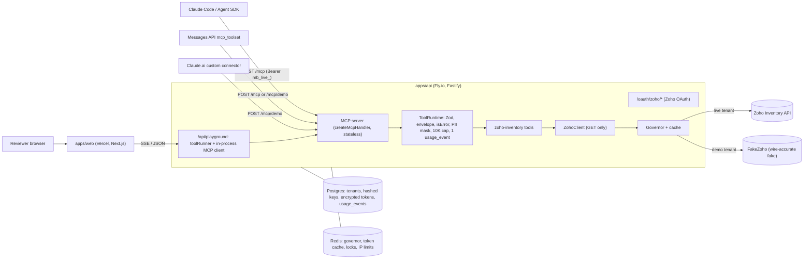

# MerchantBridge

**A private, Agent Studio-style connector that lets a merchant's AI agents read Zoho Inventory over MCP: one-time
OAuth, shared by all of the merchant's agents, scoped to one organization, read-only by construction, fully audited.**

Razorpay FDE take-home, Option 3 (private connector for a merchant tool). Independent work; not affiliated with
Razorpay or Zoho.

|                                        |                                                     |
| -------------------------------------- | --------------------------------------------------- |
| Live site                              | `LIVE_SITE_URL` **(TODO: fill after deploy)**       |
| Demo MCP endpoint (no auth, fake data) | `DEMO_MCP_URL` **(TODO: `https://<api>/mcp/demo`)** |
| 2-minute video of real Zoho OAuth      | `VIDEO_URL` **(TODO)**                              |
| Status                                 | [`docs/STATUS.md`](docs/STATUS.md)                  |

## Try it in 3 minutes (no login)

1. Open the live site, click **Try it**.
2. In `/playground`, pick a scenario card (e.g. _Dispute Responder: evidence pack for `pay_DEMO8xK2`_). A real Claude
   agent calls the real MCP server; the trace shows each tool, its args, latency, cache hit, governor decision,
   budget left and error code.
3. Flip **Zoho 429 (code 44)**: watch the backoff and a structured `RATE_LIMITED` result with `retry_after_s`. Flip
   **expired token**: watch refresh and one retry.
4. Click **"Cancel SO-00012"**: zero tool calls and a polite refusal. There are no write tools.
5. Use it from your own Claude: `claude mcp add --transport http mb-demo DEMO_MCP_URL`, then ask
   "Is CHAI-250 in stock in Bengaluru, and at what price?"
6. `/docs` shows CAN / CANNOT, client configs and the OAuth video.

## What the assignment asked, and where it is

| Asked for                        | Where                                                                                                                                                                                                                                                                       |
| -------------------------------- | --------------------------------------------------------------------------------------------------------------------------------------------------------------------------------------------------------------------------------------------------------------------------- |
| OAuth flow                       | Zoho OAuth 2.0 authorization code, multi-DC, single-flight refresh, encrypted vault: [`packages/auth`](packages/auth), `/oauth/zoho/*` in [`apps/api`](apps/api), [ADR-0004](docs/adr/0004-two-auth-legs.md), video above. Agents use a separate hashed `mb_live_` API key. |
| List / get / search primitives   | 9 tools ([table below](#tools)); schemas in [`docs/mcp-tools.json`](docs/mcp-tools.json)                                                                                                                                                                                    |
| Rate-limit handling              | Per-org governor (80/min, leases, 50% daily share, circuit on code 44, no retry on 45, jittered retry on 1070): [`packages/governor`](packages/governor), [ADR-0005](docs/adr/0005-governor-defaults-for-undocumented-429-behaviour.md), playground toggle                  |
| MCP tool specification           | [`docs/mcp-tools.json`](docs/mcp-tools.json), generated from a live `tools/list` by `pnpm gen:tools` (staleness test in CI)                                                                                                                                                 |
| What the agent can and cannot do | [`docs/agent-capabilities.md`](docs/agent-capabilities.md)                                                                                                                                                                                                                  |

## Architecture



Rules: MCP is a thin door (tools only go through `ToolRuntime`); every Zoho call goes `ZohoClient -> Governor`; public
routes are bound to the demo tenant and can never load real credentials. The playground drives the same MCP server
external hosts see.

## Tools

| Tool                             | What it answers                                               | Zoho calls                                  | Scope                                |
| -------------------------------- | ------------------------------------------------------------- | ------------------------------------------- | ------------------------------------ |
| `zoho_get_connection_status`     | Which org/DC/plan, granted scopes, budget left, circuit state | `/organizations`                            | settings.READ                        |
| `zoho_search_items`              | Products by name/SKU/text, low stock, per warehouse           | `/items`                                    | items.READ                           |
| `zoho_get_item`                  | One product with stock per warehouse and price                | `/items?sku=`, `/items/{id}`                | items.READ                           |
| `zoho_list_sales_orders`         | Orders by customer/status/date (bounded, ADR-0006)            | `/salesorders` (+ fallbacks)                | salesorders.READ                     |
| `zoho_get_sales_order`           | Order + line items + packages + tracking + invoices           | `/salesorders/{id}`                         | salesorders.READ                     |
| `zoho_search_customers`          | Customers by name/company/email/phone (masked)                | `/contacts`                                 | contacts.READ                        |
| `zoho_list_invoices`             | Unpaid/overdue/due-soon invoices, amounts in paise            | `/invoices`                                 | invoices.READ                        |
| `zoho_get_invoice`               | Balance, due date, recorded payments and refs                 | `/invoices/{id}`, `/invoices/{id}/payments` | invoices.READ                        |
| `zoho_find_by_payment_reference` | Razorpay `pay_`/`order_`/`rfnd_` -> payment -> invoice        | `/customerpayments`, `/invoices`            | customerpayments.READ, invoices.READ |
| `zoho_check_stock` (Tier 2)      | Stock for up to 25 item ids                                   | `/itemdetails`                              | items.READ                           |
| `zoho_list_shipments` (Tier 2)   | Shipped/delivered packages with tracking                      | `/packages`, `/shipmentorders/{id}`         | packages.READ, shipmentorders.READ   |

Every result: `{ data, page: { next_cursor, has_more }, meta: { organization_id, as_of, cached, zoho_url,
budget_remaining_today, demo } }`. Errors are `isError` results with `{ code, message, retryable, retry_after_s?, hint }`.

## Principles -> features

| Principle                                   | Feature                                                                                  |
| ------------------------------------------- | ---------------------------------------------------------------------------------------- |
| Review first, act later                     | Read-only by construction: GET-only client, READ-only scopes, no write tools             |
| Verified first-party data                   | `as_of` and `zoho_url` on every result; money in minor units; no inference in tools      |
| A validation layer between agent and system | Zod input/output schemas, scope checks, field allow-lists, PII masking, `untrusted_text` |
| Audit trail                                 | Exactly one `usage_event` per tool call (masked args, decisions, error code)             |
| Data stays where it is                      | No mirroring; short-TTL cache only (items 60 s, org 300 s)                               |
| Shared limits are a shared resource         | One governor per Zoho org for all agents; 50% daily share                                |

## Quickstart (local demo, no credentials)

```sh
pnpm i
pnpm dev:api    # http://localhost:8787  (MCP demo at /mcp/demo, FakeZoho, in-memory stores)
pnpm dev:web    # http://localhost:3000
claude mcp add --transport http mb-local http://localhost:8787/mcp/demo
npx @modelcontextprotocol/inspector --cli http://localhost:8787/mcp/demo --transport http --method tools/list
```

Live Zoho, deployment and env vars: [`docs/integration.md`](docs/integration.md).

## Repo map

```
apps/api                 Fastify: /mcp, /mcp/demo, /oauth/zoho/*, /api/playground (SSE), /api/explorer, /health/*
apps/web                 Next.js site: /, /playground, /tools, /connect, /docs
packages/core            ToolRuntime, envelope, errors, Kv, Clock, money/masking/cursors, trace + usage types
packages/governor        per-org rate governor + cache
packages/auth            Zoho DC map, OAuth state, code exchange, AES-256-GCM vault, refresh, API keys
packages/db              Drizzle schema + migrations (tenants, api_keys, connections, usage_events)
packages/zoho-inventory  ZohoClient, mappers, tools, FakeZoho (wire-accurate fake + demo dataset + faults)
evals/                   scenario questions + expected tools, same toolRunner loop as the playground
docs/                    PLAN, STATUS, capabilities, integration, runbook, ADRs, notes, vendored specs
```

## Testing

- **Contract suite:** every tool, through a real in-process MCP client (`handler.fetch`), in both MCP protocol eras:
  valid args -> schema-valid `structuredContent`; bad args -> `INVALID_INPUT`; unknown id -> `NOT_FOUND`;
  <= 10K tokens; allow-listed fields; one usage event. Runs on FakeZoho and on recorded, PII-scrubbed trial-org
  fixtures.
- **Failure tests:** 401 -> refresh -> retry, 403, 404, 429 codes 44/45/1070, 5xx, timeout, malformed JSON, bad OAuth
  state, refresh failure, empty results; governor on fake timers (two agents stay <= 80/min).
- **Security tests:** no tokens in logs/responses, writes impossible, tenant isolation, public routes demo-only, no URL
  inputs, prompt injection stays in `untrusted_text`.
- **Evals:** scenario cards, refusals, injection and per-tool questions on `claude-haiku-4-5` and
  `claude-sonnet-5-5`; reports in `evals/reports/` **(TODO: pass rates)**.

```sh
pnpm lint && pnpm typecheck && pnpm test   # all packages
pnpm gen:tools                              # regenerate docs/mcp-tools.json
pnpm evals                                  # needs ANTHROPIC_API_KEY
```

## Security notes

- Zoho refresh tokens encrypted with AES-256-GCM; access tokens only in Redis (55 min); never passed to MCP clients.
- Agent keys `mb_live_…` shown once (URL fragment), stored as SHA-256, revocable.
- OAuth `state` is HMAC-signed, single-use, 10-minute; callback accounts server and `api_domain` checked against an
  allow-list of Zoho hosts.
- MCP Host-header allow-list (DNS-rebinding protection); per-IP limits on `/mcp/demo` and the playground; Turnstile;
  spend-capped Anthropic workspace with a kill switch and replay fallback.
- Usage events store masked arguments only and are deleted after 30 days (data minimisation in the spirit of India's
  DPDP Act; not a compliance certification).
- Supply chain: exact-pinned dependencies, gitleaks in CI, Dependabot, CodeQL and secret scanning on the public repo.

## Limitations

- `/salesorders` has no documented filters: customer/status/date filters fall back to related documents and a bounded
  scan of the 600 most recent orders ([ADR-0006](docs/adr/0006-sales-order-search-fallback.md)).
- Which Zoho field holds a Razorpay reference is undocumented; lookups use `reference_number` until smoke results say
  otherwise ([ADR-0001](docs/adr/0001-zoho-api-assumptions-and-smoke-results.md)).
- Zoho's 429 recovery, block duration and daily reset are undocumented; governor defaults are assumptions
  ([ADR-0005](docs/adr/0005-governor-defaults-for-undocumented-429-behaviour.md)).
- Live tenants authenticate with an API key; OAuth on the MCP leg (Claude.ai Connect card) is Tier 3.
- UK and China Zoho data centers are not supported (no documented Inventory API host / accounts server pair).
- Zoho limits are shared with the merchant's other integrations, including Zoho's own MCP; we can only govern our
  share ([ADR-0007](docs/adr/0007-why-not-zoho-mcp-or-composio.md) explains why we built this anyway).

## Built with Claude Code

Every milestone ran the same loop: plan mode with a <= 40-line prompt ([`docs/prompts/`](docs/prompts/)) -> red tests
committed first -> implementation -> `/verify` -> `/code-review high` and `/security-review` -> `/simplify` -> PR.
Library usage newer than the model's training data (MCP SDK v2, Anthropic `mcpTools`) was grounded in notes checked
against the installed packages ([`docs/notes/`](docs/notes/)), and Zoho facts come only from the vendored OpenAPI
with `UNVERIFIED` tags plus human-run smoke probes. Packages were built by parallel agents against one frozen
contract (`packages/core`).

- PR showing plan -> red tests -> implementation -> review fixes: **TODO (link)**
- PR showing the governor built test-first on fake timers: **TODO (link)**
- Eval-driven tool-description fix with before/after report: **TODO (link)**
- Project toolkit (commands, skill, subagents, hooks): [`.claude/`](.claude/)
